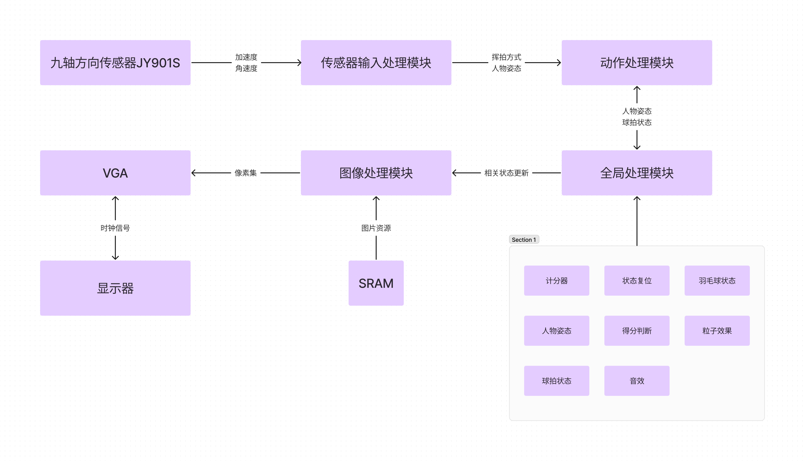
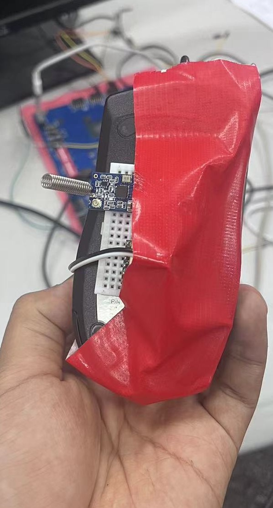

# 火柴人羽毛球4 实验报告

#### 原嘉锐 王溢

## 一、总体设计

### 1. 项目简介

我们的项目取材自4399上的一款经典小游戏《火柴人羽毛球3》，其本体是一款非常简洁的双人对战或人机对战小游戏，我们希望在该游戏的基础之上实现以下功能：

- 游戏基本功能的全部复刻
- 不同挥拍方式的分离（原游戏只有一个键）
- 体感挥拍
- 抢七以后的加时赛机制

### 2. 总体划分



我们的项目总体划分如上，大致分为输入模块、输出模块与主逻辑模块

- 输入模块：同时接收键盘、鼠标与传感器的输入，分别控制两个玩家，允许键盘-键盘对战和键盘-手柄对战
- 主逻辑模块：根据输入的信号控制人物运动和挥拍动作，并进一步计算羽毛球运动轨迹和得分情况
- 输出模块：将所有游戏元素绘制到屏幕上

### 3. 分工

- 原嘉锐同学负责：RAM和SRAM控制模块，图像绘制模块，人物运动模块，计数器模块，游戏进程控制模块，羽毛球运动模块
- 王溢同学负责：输入信号的解码与调试，无线模块调试，贴图制作，挥拍动作模块，击球状态模块，复位过滤与初始化模块

## 二、模块分析

### 1. 输入模块

我们采用的输入方式一共分为两种，键盘模式和手柄模式手柄由鼠标和传感器组合而成，输入模块的最终目的是要将解析输入信号并相对应地修改 `reg input_signal[3:0][5:0]`的值，该参数是输入与主逻辑通信的唯一参数，有效地实现了解耦合

`input_signal`的第一维代表了不同玩家的操作向量（包括复位），第二维代表了不同的操作，具体包括移动、跳跃与挥拍，详细的控制代码为：

```sv
always @(posedge clk) begin
    if (rst) begin
        out_number <= 32'b0;
        input_signal <= 24'b0;
    end else begin
        if (scancode_valid) begin
            out_number <= {in_number, scancode};
            unique case(scancode)
                ESC: begin
                    if (in_number[7:0] == STOP) begin
                        input_signal[0][RST] <= DIS_ABLE;
                    end 
                    else begin
                        input_signal[0][RST] <= ABLE; // ESC
                    end
                end
                W: begin 
                    if (in_number[7:0] == STOP) begin
                        input_signal[1][JUMP] <= DIS_ABLE;
                    end
                    else begin 
                        input_signal[1][JUMP] <= ABLE; // W
                    end
                end 
                A: begin 
                    if (in_number[7:0] == STOP) begin
                        input_signal[1][LEFT] <= DIS_ABLE;
                    end
                    else begin 
                        input_signal[1][LEFT] <= ABLE; // A
                    end
                end 
                D: begin 
                    if (in_number[7:0] == STOP) begin
                        input_signal[1][RIGHT] <= DIS_ABLE;
                    end
                    else begin 
                        input_signal[1][RIGHT] <= ABLE; // D
                    end
                end 
                J: begin 
                    if (in_number[7:0] == STOP) begin
                        input_signal[1][UP_SWING] <= DIS_ABLE;
                    end
                    else begin 
                        input_signal[1][UP_SWING] <= ABLE; // J
                    end
                end 
                K: begin 
                    if (in_number[7:0] == STOP) begin
                        input_signal[1][DOWN_SWING] <= DIS_ABLE;
                    end
                    else begin 
                        input_signal[1][DOWN_SWING] <= ABLE; // K
                    end
                end 
                UPA: begin
                    if (in_number[7:0] == STOP) begin
                        input_signal[2][JUMP] <= DIS_ABLE; // UP
                    end
                    else if (in_number[7:0] == START) begin
                        input_signal[2][JUMP] <= ABLE;
                    end
                end 
                LEFTA: begin 
                    if (in_number[7:0] == STOP) begin
                        input_signal[2][LEFT] <= DIS_ABLE; // Left
                    end if (in_number[7:0] == START) begin
                        input_signal[2][LEFT] <= ABLE;
                    end
                end
                RIGHTA: begin
                    if (in_number[7:0] == STOP) begin
                        input_signal[2][RIGHT] <= DIS_ABLE; // Right
                    end if (in_number[7:0] == START) begin
                        input_signal[2][RIGHT] <= ABLE;
                    end
                end
                K1: begin 
                    if (in_number[7:0] == STOP) begin
                        input_signal[2][UP_SWING] <= DIS_ABLE;
                    end
                    else begin 
                        input_signal[2][UP_SWING] <= ABLE; // 1
                    end
                end 
                K2: begin 
                    if (in_number[7:0] == STOP) begin
                        input_signal[2][DOWN_SWING] <= DIS_ABLE;
                    end
                    else begin 
                        input_signal[2][DOWN_SWING] <= ABLE; // 2
                    end
                end 
                default: input_signal <= input_signal;
            endcase
        end
        else begin
            if (mouse_click[0] == 1'b1) begin
                input_signal[3][LEFT] <= ABLE;
            end
            else begin
                input_signal[3][LEFT] <= DIS_ABLE;
            end
            if (mouse_click[1] == 1'b1) begin
                input_signal[3][RIGHT] <= ABLE;
            end
            else begin
                input_signal[3][RIGHT] <= DIS_ABLE;
            end
            if (mouse_click[2] == 1'b1) begin
                input_signal[3][JUMP] <= ABLE;
            end
            else begin
                input_signal[3][JUMP] <= DIS_ABLE;
            end
            if (angular_v > 5744) begin
                input_signal[3][UP_SWING] <= ABLE;
            end
            else begin
                input_signal[3][UP_SWING] <= DIS_ABLE;
            end
            if(angular_v < -5744) begin
                input_signal[3][DOWN_SWING] <= ABLE;
            end
            else begin
                input_signal[3][DOWN_SWING] <= DIS_ABLE;
            end
        end
    end
end
```

#### 1.1 手柄结构

将面包板粘贴在鼠标背面，并且将传感器与无线模块固定在面包板上，通过一个充电宝进行供电，并且用一块巨大的胶布进行固定；实验板一侧的无线模块直接通过杜邦线连接到板上的pmod模块



操作方面，鼠标左右键分别代表向左向右移动，中键代表跳跃，而挥拍操作是通过挥动手柄来实现

#### 1.2 键鼠模块

键盘和鼠标的读入我们直接使用了代码仓库中提供的 `ps2_keyboard`与 `ps2_mouse`模块，得到了当前键盘的扫描码与鼠标是否被按下的信息，经过如下处理：

- 鼠标直接检测是否按下并将对应信号置 `1`
- 对于键盘，实现一个 `unique case`来匹配当前的扫描码，以此匹配玩家是否按下特定的按键，将对应信号置 `1`
- 同时我们记录上一个时钟周期的扫描码，如果上一个时钟周期扫描码为特定的 `8'hF0`，则说明为断码，将对应信号置 `1`

如此我们实现了不同信号的并行输入，防止了其互相的干扰，使得我们的实现更加贴合真实世界（显然我们可以做到向前跳跃同时挥拍等复杂操作）

#### 1.3 传感器模块

分为异步接收模块与信息解码模块，其中异步接收模块的信息为：
|接口|类型|说明|
|:-:|:-:|:-:|
|clk|input|异步接收传感器数据的时钟|
|rst|input|同步复位信号|
|rxd|input|传感器原始的比特数据|
|rxd_data_ready|output|同步后的信息是否完整|
|rxd_data|output|同步后的信息|

信息解码模块为：
|接口|类型|说明|
|:-:|:-:|:-:|
|clk|input|传感器数据解码时钟|
|rst|input|同步复位信号|
|rxd|input|同步后的传感器数据|
|angular_v|output|解码后的Z轴角速度|

我们使用的传感器是JY901S陀螺仪，并使用了汇承 HC-12 433MHz 无线模块进行无线通讯

由于挥拍是一个圆周运动，其具有很强的对称性，容易发生误触，如果需要精确判断需要使用至少二阶导数，而用硬件进行倒数运算是非常困难的，因此经过多种方法的尝试，最终选用了角速度这个量，并通过阈值来进行简单但有效的判断。

我们参考了[这个网站](https://www.fpga4fun.com/SerialInterface.html)进行数据读入，改写了其中的部分代码以适配我们的传感器参数。

读入数据之后，我们参考了[这个网站](https://wit-motion.yuque.com/wumwnr/ltst03/vl3tpy?#%20%E3%80%8AWIT%E7%A7%81%E6%9C%89%E5%8D%8F%E8%AE%AE%E3%80%8B)中的协议格式，对于数据进行解码，并向对应的转化为 `input_signal`中的向量，主要是通过一个状态机来实现，如下：

```sv
always_ff @(posedge clk) begin
    if(rst) begin
        byte_index <= 0;
        data_type <= 0;
        checksum <= 0;
        angle_tmp <= 0;
        angular_v_tmp <= 0;
        angular_v <= 0; 
    end
    else if(next_byte) begin
        if(byte_index == 0) begin // 头部
            if(data == HEADER) begin
                byte_index <= 1;
                checksum <= HEADER;
            end
            else begin
                byte_index <= 0;
                checksum <= 0;
            end
        end
        else if (byte_index < DATA_LENGTH - 1) begin // 数据段
            byte_index <= byte_index + 1;
            checksum <= checksum + data;
            if(byte_index == TYPEB) begin
                data_type <= data;
            end
            else if (byte_index == ZDATALB) begin
            if(data_type == ANGULAR_V) begin
                angular_v_tmp[7:0] <= data;
            end
        end
        else if (byte_index == ZDATAHB) begin
                if(data_type == ANGULAR_V) begin
                    angular_v_tmp[15:8] <= data;
                end
            end
        end
        else if (byte_index == DATA_LENGTH - 1) begin // 检验和
            if (checksum == data) begin
                if(data_type == ANGULAR_V) begin
                    angular_v <= angular_v_tmp;
                end
            end
            byte_index <= 0;
            checksum <= 0;
        end
    end  
end

```

#### 1.4 封装

输入模块总体被封装在 `ps2_decoder.sv`中，原本想进一步解耦，但是遇到了一些问题，例如将 `input_signal`的某些位传递给模块作为参数会出现问题，最终决定将修改 `input_signal`也即解码部分放在一个模块中，各种输入的读入部分分别放在不同模块中

### 2. 画面绘制模块

#### 2.1 双口RAM控制模块
|接口|类型|说明|
|:-:|:-:|:-:|
|clk_rd|input|控制读RAM的时钟|
|clk_wr|input|控制写RAM的时钟|
|rst_n|input|同步复位信号|
|input_pixel|input|RAM的写端口要写入的像素色值|
|write_x|input|要写入的信息对应屏幕中位置的x坐标|
|write_y|input|要写入的信息对应屏幕中位置的y坐标|
|read_x|input|要读出的信息对应屏幕中位置的x坐标|
|read_y|input|要读出的信息对应屏幕中位置的y坐标|
|write_finished|output|是否写完一帧图像|
|output_pixel|output|要从读端口读出的像素色值|
|output_valid|output|该次读取是否有效|

为了让画面显示的帧率足够高，给玩家带来更好的游戏体验，我们组使用了双口RAM来进行屏幕上元素的绘制，具体实现思路为把RAM一部分用于读，另一部分用于写。需要注意读于写所使用的时钟并不相同

- **读**  
VGA的hdata和vdata两个同步信号，本质上就是当前屏幕扫到的read_x坐标和read_y坐标，而读也就是要从已经写好的RAM中读到这个位置像素的色值，我们设屏幕的宽为hsize,高为vsize，则双口RAM的地址计算公式满足
$$ read\_address = hdata+vdata*hsize $$
则在该地址读出色值即可

- **写**  
当前写的坐标和色值由绘制模块计算出，而对于双口RAM，写地址也满足上述公式，即
$$ write\_address = write_x+write_y*hsize$$

- **读写帧切换**  
当一帧绘制结束后，交换读写的部分，所以为了保证上一帧已经被完整显示到屏幕上，我们组把读时钟设置为50Mhz,而把写时钟设置为33Mhz，从而保证了流畅的画面切换，最终画面帧率可以达$ \frac{33*10^6}{480000}=68.75$帧
```v
module ram_controllor#(
    parameter COOR_WIDTH = 12,
    parameter RAM_WIDTH = 19,
    parameter HSIZE = 720,
    parameter VSIZE = 540
)(
    input wire clk_rd,
    input wire clk_wr,
    input wire rst_n,
    input wire [11:0] input_pixel,

    input wire [COOR_WIDTH-1:0] write_x,
    input wire [COOR_WIDTH-1:0] write_y,

    input wire [COOR_WIDTH-1:0] read_x,
    input wire [COOR_WIDTH-1:0] read_y,

    input wire write_finished,

    output reg [11:0] output_pixel,
    output wire output_valid
    
);
    reg en_wr_1, en_wr_2, we_wr_1, we_wr_2, en_rd_1, en_rd_2;
    wire [RAM_WIDTH-1:0] wr_address, rd_address;
    wire read_finished;

    // Write and read addresses
    assign wr_address = write_x + write_y * HSIZE;
    assign rd_address = (read_x-40) + (read_y-30) * HSIZE;
    
    // Write control logic
    always_ff @(posedge clk_wr) begin
        if (rst_n) begin
            en_wr_1 <= 1;
            en_wr_2 <= 0;
            we_wr_1 <= 1;
            we_wr_2 <= 0;
            en_rd_1 <= 0;
            en_rd_2 <= 1;
        end
        else if (write_finished) begin
            en_wr_1 <= ~en_wr_1;
            en_wr_2 <= ~en_wr_2;
            we_wr_1 <= ~we_wr_1;
            we_wr_2 <= ~we_wr_2;
            en_rd_1 <= ~en_rd_1;
            en_rd_2 <= ~en_rd_2;
        end
        else begin
            en_wr_1 <= en_wr_1;
            en_wr_2 <= en_wr_2;
            we_wr_1 <= we_wr_1;
            we_wr_2 <= we_wr_2;
        end
    end

    // Read finished signal
    assign read_finished = (read_y == VSIZE - 1 && read_x == HSIZE - 1);


    // Output signals for RAM instances
    reg [11:0] doutb_1, doutb_2;

    // RAM instance 1
    ram_dual ram_1(
        .addra(wr_address),
        .clka(clk_wr),
        .dina(input_pixel),
        .ena(en_wr_1),
        .wea(we_wr_1),
        .addrb(rd_address),
        .clkb(clk_rd),
        .doutb(doutb_1),
        .enb(en_rd_1)
    );

    // RAM instance 2
    ram_dual ram_2(
        .addra(wr_address),
        .clka(clk_wr),
        .dina(input_pixel),
        .ena(en_wr_2),
        .wea(we_wr_2),
        .addrb(rd_address),
        .clkb(clk_rd),
        .doutb(doutb_2),
        .enb(en_rd_2)
    );

    // Mux to select the correct output pixel
    always_ff @(posedge clk_rd) begin
        if (en_rd_1) begin
            output_pixel <= doutb_1;
        end
        else if (en_rd_2) begin
            output_pixel <= doutb_2;
        end
    end

    assign output_valid = en_rd_1 || en_rd_2;

endmodule
```
#### 2.2 SRAM读取模块
|接口|类型|说明|
|:-:|:-:|:-:|
|clk|input|读取内容的时钟|
|rst_n|input|同步复位信号|
|read_x|input|从SRAM的坐标x处读取信息|
|read_y|input|从SRAM的坐标y处读取信息|
|base_ram_data|inout|特殊的inout类型，用于读写SRAM，此处只用于读|
|base_ram_addr|output|SRAM的内存地址|
|pixel_data|output|读取到的像素色值|

对于SRAM我们只使用了从SRAM中读取信息来实现游戏开始界面的绘制，故实现相对容易，只需要将hdata和vdata作为read_x和read_y输入然后在SRAM的对应地址读取色值即可

#### 2.3 绘制模块

##### **top_painter模块**  

|接口|类型|说明|
|:-:|:-:|:-:|
|clk|input|写RAM的时钟|
|rst_n|input|同步复位信号|
|elements_all|input|所有要绘制的游戏元素|
|record_x|input|羽毛球的运动轨迹记录，用于粒子效果绘制|
|record_y|input|羽毛球的运动轨迹记录，用于粒子效果绘制|
|write_x|output|该时刻绘制像素点在屏幕上的x坐标，对应写到RAM中的地址|
|write_y|output|该时刻绘制像素点在屏幕上的y坐标，对应写到RAM中的地址|
|pixel_data|output|该时刻绘制像素点的色值|
|finished|output|是否画完一帧图像，当该帧所有元素和背景都画好以后为高电平|

top_painter主要是对element_painter和background_painter的控制

- **elements_all的解释**  
这是一种有着很高可拓展性的绘制方式，我们定义了element_pos_size_rom的结构体，内容为一个元素在屏幕上的位置，元素的大小以及元素在ROM中的位置，而elements_all则是该结构体的数组，对于元素绘制其本质就是要根据这些信息把所有的元素都绘制出来。
如下为对element_pos_size_rom的定义
```v
    typedef struct packed{
        reg [11:0] x;   // 屏幕位置
        reg [11:0] y;
        reg [11:0] width; // 大小
        reg [11:0] height; 
        reg [11:0] rom_x; // ROM中的位置
        reg [11:0] rom_y;
    } element_pos_size_rom;
```

- **一帧绘制结束的控制**  
首先进行背景的绘制，等背景绘制结束后才开始进行元素的绘制，元素需要按照遮挡关系排好顺序，然后有element_painter逐个绘制，所有元素都绘制结束后，输出该帧绘制结束的信号，告诉双口RAM可以切换读写。

##### **element_painter模块**

|接口|类型|说明|
|:-:|:-:|:-:|
|clk|input|写元素像素的时钟|
|rst_n|input|同步复位时钟|
|ena|input|ROM读取使能，实际上常为1|
|sprite_x|input|图片在ROM中存储位置的x坐标，为事先定义好的常量|
|sprite_y|input|图片在ROM中存储位置的y坐标，为事先定义好的常量|
|x_pixel|input|该元素的左上角在屏幕上的x坐标，用于计算write_x|
|y_pixel|input|该元素的左上角在屏幕上的y坐标,用于计算write_y|
|width|input|该元素的宽|
|height|input|该元素的高|
|write_x|output|写到RAM中的x坐标|
|write_y|output|写到RAM中的y坐标|
|pixel_data|output|该时刻在ROM中读取的像素色值|
|write_finished|output|是否画完该元素|

- **元素图片的存储**  
我们组使用RGB444将色值进行压缩后，除了开始界面所有游戏图片以及双口RAM都可以仅仅使用片内RAM完成,所以element_painter本质上就是在读取ROM。

- **ROM读取以及读取结束**  
这个过程类似于双口RAM的读取，故不在此再次赘述，一个需要注意的点事区别于双口RAM使用相对于屏幕hdata和vdata，这里的读是相对于RAM而言的，也就是需要使用写时钟
```v
module element_painter#(COOR_WIDTH = 12, ROM_WIDTH=19,ROM_PICTURE_WIDTH=404)( 
    input wire clk,
    input wire rst_n,
    input wire ena,

    input wire [COOR_WIDTH-1:0] sprite_x,
    input wire [COOR_WIDTH-1:0] sprite_y,

    input wire [COOR_WIDTH-1:0] x_pixel,
    input wire [COOR_WIDTH-1:0] y_pixel,

    input wire [COOR_WIDTH-1:0] width,
    input wire [COOR_WIDTH-1:0] height,

    output reg [COOR_WIDTH-1:0] write_x,
    output reg [COOR_WIDTH-1:0] write_y,
    output wire [11:0] pixel_data,
    output wire write_finished

    ); 
    
        
        reg [ROM_WIDTH-1:0] rom_addr;
        reg [COOR_WIDTH-1:0] x;
        reg [COOR_WIDTH-1:0] y;
        reg [COOR_WIDTH-1:0] last_x[1:0];
        reg [COOR_WIDTH-1:0] last_y[1:0];
        reg finished;

        always_ff @(posedge clk) begin
            finished<=0;
            if(rst_n)begin
                x<=0;
                y<=0;
                finished<=0;
                last_x[0]<=0;
                last_y[0]<=0;
                last_x[1]<=0;
                last_y[1]<=0;
            end
            else begin
                if (y!=height)begin
                    if (x==width-1)begin
                        x<=0;
                        y<=y+1;
                    end
                    else begin
                        x<=x+1;
                    end
                end
                else begin 
                    finished<=1;
                    y<=0;
                end
            end
             last_x[0]<=x;
             last_x[1]<=last_x[0];
             last_y[0]<=y;
             last_y[1]<=last_y[0];
        end
        assign write_finished=finished;
        assign rom_addr = (sprite_x+x)+ROM_PICTURE_WIDTH*(sprite_y+y);
        
        blk_mem_gen_0 rom (
            .clka(clk), // input clka
            .addra(rom_addr), // input addra
            .douta(pixel_data), // output [11 : 0] douta
            .ena(ena)
        );

        always_comb begin
            write_x = x_pixel + last_x[1];//x;
            write_y = y_pixel + last_y[1];//y;
        end

endmodule
```


##### **background_painter模块**

|接口|类型|说明|
|:-:|:-:|:-:|
|clk|input|写背景像素的时钟|
|rst_n|input|同步复位信号|
|record_x|input|羽毛球运动轨迹记录，用于绘制粒子效果|
|record_y|input|羽毛球运动轨迹记录，用于绘制粒子效果|
|show_bling|input|是否显示粒子效果|
|pixel_data|output|该时刻计算出的背景颜色的像素色值|
|write_x|output|写到RAM中的x坐标|
|write_y|output|写到RAM中的y坐标|
|finished|output|背景是否绘制完成|

由于火柴人羽毛球这个游戏本身的游戏背景并不复杂，所以可以使用一些线性的函数进行绘制，而不需要进行存储，大大节省了存储资源。

#### 2.4 RGB转换模块
|接口|类型|说明|
|:-:|:-:|:-:|
|rgb444|input|输入rgb444色值|
|to_black|input|是否将屏幕的局部变暗（半透明黑色效果）|
|hdata|input|水平同步信号（本质就是当前屏幕绘制到的x坐标）|
|vdata|input|垂直同步信号（本质就是当前屏幕绘制到的y坐标）|
|rgb888|output|输出rgb888色值|

- **转化**  
由于HDMI输出时，还是需要一个RGB88的色值，所以我们还需要在输出时把RGB444转变为RGB888，具体计算公式如下（仅展示R这个通道的颜色变化，对于G通道和B通道也完全相同）
$$ RGB888 = [rgb444[11:8]<<4+rgb444[11:8],...] $$

- **半透明黑色**  
其实本质上就是要让想要半透明黑化的地方色值变暗淡，根据rgb的特点，我们只需要将对应位置的色值减一个常数，就可以达到变暗的效果。
核心部分代码如下
```v
module rgb444_to_rgb888 (
    input wire [11:0] rgb444,
    input wire to_black,
    input wire[11:0] hdata,
    input wire[11:0] vdata,
    output reg [23:0] rgb888
);
    always_comb begin
        if(!to_black)begin
            rgb888 = {rgb444[11:8],rgb444[11:8],rgb444[3:0],rgb444[3:0],rgb444[7:4],rgb444[7:4]};
        end
        else begin
            if(hdata>=283&&vdata>=220&&hdata<=483&&vdata<=355)begin
                rgb888 = {rgb444[11:8],rgb444[11:8],rgb444[3:0],rgb444[3:0],rgb444[7:4],rgb444[7:4]};
            end
            else begin
               rgb888 = {
                (rgb444[11:8] > 4'h2 ? rgb444[11:8] - 4'h2 : 4'h0), (rgb444[11:8] > 4'h2 ? rgb444[11:8] - 4'h2 : 4'h0),
                (rgb444[3:0] > 4'h2 ? rgb444[3:0] - 4'h2 : 4'h0), (rgb444[3:0] > 4'h2 ? rgb444[3:0] - 4'h2 : 4'h0),
                (rgb444[7:4] > 4'h2 ? rgb444[7:4] - 4'h2 : 4'h0), (rgb444[7:4] > 4'h2 ? rgb444[7:4] - 4'h2 : 4'h0)
            };
            end
        end
    end
endmodule
```

### 3. 主逻辑模块

#### 2.1 人物运动模块
|接口|类型|说明|
|:-:|:-:|:-:|
|clk|input|控制角色运动计算的时钟|
|rst_n|input|同步复位信号|
|move_left|input|向左移动信号|
|move_right|input|向右移动信号|
|jump|input|跳跃信号|
|gaming|input|游戏是否在进行中|
|write_finished|input|上一帧是否绘制完成|
|player_x|output|这一帧角色元素左上角在屏幕上的x坐标|
|player_y|output|这一帧角色元素左上角在屏幕上的y坐标|
|curr_state_name|output|角色现在的状态的enum类型(角色移动的动画通过设置不同状态来完成)|
|player_curr_state|output|角色当前状态对应的图片元素在ROM中的存储位置以及图片大小，为预先设定好的常量|

人物的运动有两个维度：左右移动、跳跃。且两者可以同时进行

- **左右移动**  
左右移动涉及到“动画”，也即运动应该是有动作的，这需要涉及到图片资源的切换，而实现图片切换的最好方案就是使用状态机，为了让动作足够流畅，我们对于两个角色都使用了5个状态来实现移动动作。
状态机的定义如下:
```v
package playerA_move_machine;
    import main_package::*;
    typedef enum{
        Idle,
        Move_1,
        Move_2,
        Move_3,
        Move_4
    }playerA_move_states_name;

    // 玩家A运动状态机
    typedef struct packed{
        reg [11:0] width;
        reg [11:0] height;
        reg [11:0] rom_pos_x;
        reg [11:0] rom_pos_y;
    } playerA_move_state;

    // 硬编码
    parameter playerA_move_state playerA_move_states[5]='{
        Idle:'{sprite_size[PlayerA][0],sprite_size[PlayerA][1],pos_in_rom[PlayerA][0],pos_in_rom[PlayerA][1]},
        Move_1:'{sprite_size[PlayerA_move1][0],sprite_size[PlayerA_move1][1],pos_in_rom[PlayerA_move1][0],pos_in_rom[PlayerA_move1][1]},
        Move_2:'{sprite_size[PlayerA_move2][0],sprite_size[PlayerA_move2][1],pos_in_rom[PlayerA_move2][0],pos_in_rom[PlayerA_move2][1]},
        Move_3:'{sprite_size[PlayerA_move3][0],sprite_size[PlayerA_move3][1],pos_in_rom[PlayerA_move3][0],pos_in_rom[PlayerA_move3][1]},
        Move_4:'{sprite_size[PlayerA_move4][0],sprite_size[PlayerA_move4][1],pos_in_rom[PlayerA_move4][0],pos_in_rom[PlayerA_move4][1]}
    };
endpackage
```

- **跳跃**  
跳跃是比较简单的动作，只需要注意跳跃过程中屏蔽掉新的跳跃信号即可。

#### 2.2 球拍控制模块
|接口|类型|说明|
|:-:|:-:|:-:|
|clk|input|控制球拍挥动和位置计算的时钟|
|rst_n|input|同步复位信号|
|up_swing|input|上挥拍信号|
|down_swing|input|下挥拍信号|
|holding|input|是否为当前角色持球，用于判断发球方|
|player_curr_state|input|当前角色的移动状态，用于计算拍子和角色坐标的offset|
|player_x|input|当前角色元素左上角在屏幕上的x坐标，结合角色状态提供的offset信息计算球拍的基础x坐标|
|player_y|input|当前角色元素左上角在屏幕上的x坐标，结合角色状态提供的offset信息计算球拍的基础x坐标|
|write_finished|input|上一帧是否绘制结束|
|gamimg|output|游戏是否在进行中|
|pat_x|output|球拍元素左上角的x坐标|
|pat_y|output|球拍元素左上角的y坐标|
|pat_collision|output|球拍的碰撞箱信息|
|pat_curr_state_name|output|球拍现在的状态，用于代表球拍转动的角度|
|pat_curr_state|output|当前球拍元素在ROM中存储的位置和图片大小，为预先设置好的常量|

球拍的运动是我们的核心之一，在这个模块主要实现的功能为球拍的控制，包括其旋转角度的计算、球拍位置的计算与碰撞箱的相关数据计算

其中一个核心的问题是如何确定球拍的角度，前提是我们没有引入任何计算浮点数或三角函数的`ip`核，因此直接计算是非常困难的（当然也可以手搓泰勒），我们采用的方法是将连续的旋转过程离散化，我们将一个$360$度的圆周拆分为$18$个区间，每$20$度一个区间，这样我们只需在ROM中存储每一个区间所对应的一个状态并进行读取即可，也即我们将一个比较复杂的数学问题转化成了一个状态机，这种编程方法是很符合硬件的思维的。

此外我们在实现过程中还遇到了一些意想不到的问题，例如我们需要让每次完成挥拍后球拍回到初始位置，这就会导致一些时候往回挥拍的时候会出现击球的状况，因此我们采用了更多的特判，在一些时候去除了球拍的碰撞箱

以玩家A为例，核心代码为：

```sv
else if(direction == 2'b01) begin
    change_picture_record <= change_picture_record + 1;
    if(change_picture_record == change_picture_count) begin
        change_picture_record <= 0;
        case (next_state)
            Idle_1: begin
                if(up_back == 1'b0) begin
                    next_state <= Up_1;
                end
                else begin
                    next_state <= Idle_1;
                    finished <= 1;
                    up_back <= 1'b0;
                end
            end 
            Up_1: next_state <= (up_back == 1'b0) ? Up_2 : Idle_1;
            Up_2: next_state <= (up_back == 1'b0) ? Up_3 : Up_1;
            Up_3: next_state <= (up_back == 1'b0) ? Up_4 : Up_2;
            Up_4: next_state <= (up_back == 1'b0) ? Up_5 : Up_3;
            Up_5: next_state <= (up_back == 1'b0) ? Up_6 : Up_4;
            Up_6: next_state <= (up_back == 1'b0) ? Up_7 : Up_5;
            Up_7: begin
                up_back <= 1'b1;
                next_state <= Up_6;
            end
            default: next_state <= Idle_1;
        endcase
    end
end
else if (direction == 2'b10) begin
    if(holding) begin
        gaming_A <= 1'b1;
    end 
    change_picture_record <= change_picture_record + 1;
    if(change_picture_record == change_picture_count) begin
        change_picture_record <= 0;
        case (next_state)
            Idle_1: next_state <= Idle_2;
            Idle_2: next_state <= Down_1;
            Down_1: next_state <= Down_2;
            Down_2: next_state <= Down_3;
            Down_3: next_state <= Down_4;
            Down_4: next_state <= Down_5;
            Down_5: next_state <= Down_6;
            Down_6: next_state <= Down_7;
            Down_7: next_state <= Down_8;
            Down_8: next_state <= Down_9;
            Down_9: next_state <= Down_10;
            Down_10: next_state <= Down_11;
            Down_11: next_state <= Down_12;
            Down_12: begin 
                next_state <= Idle_1;
                finished <= 1;
            end
            default: next_state <= Idle_1;
        endcase
    end
end
```

我们通过`next_state`来控制下一时刻绘画出的状态，其中上挥拍的时候由于有一个往回挥拍的操作，因此我们需要引入一个`up_back`变量来跟踪其进度

我们采用`direction`变量而不是直接采用输入的信号来进行相因处理，原因是直接采用信号量会导致过快的两个信号之间出现相互干扰

#### 2.3 羽毛球运动模块
|接口|类型|说明|
|:-:|:-:|:-:|
|clk|input|控制羽毛球运动计算的时钟|
|rst_n|input|同步复位信号|
|gamingA|input|是否为A发球（特指开球）|
|gamingB|input|是否为B发球（特指开球）|
|write_finished|input|上一帧是否绘制结束|
|playerA|input|当前玩家A的位置信息|
|playerB|input|当前玩家B的位置信息|
|playerA_pat|input|当前玩家A球拍碰撞箱的位置|
|patA_up|input|当前玩家A是否上挥拍|
|patA_down|input|当前玩家A是否下挥拍|
|playerB_pat|input|当前玩家B球拍碰撞箱的位置|
|patB_up|input|当前玩家B是否上挥拍|
|patB_down|input|当前玩家B是否下挥拍|
|net|input|球网碰撞箱的位置|
|playerA_state_name|input|玩家A当前移动状态（指图片），用于计算发球前，球的位置|
|playerB_state_name|input|玩家B当前移动状态（指图片），用于计算发球前，球的位置|
|restart|input|游戏重新开始信号|
|pat_A_curr_state_name|input|球拍A的状态，用于代表球拍A的转动角度|
|pat_B_curr_state_name|input|球拍B的状态，用于代表球拍B的转动角度|
|badminton|output|羽毛球的状态，用于代表球的转动角度|
|badminton_x|output|羽毛球元素左上角在屏幕上的x坐标|
|badminton_y|output|羽毛球元素左上角在屏幕上的y坐标|
|player1_add_score|output|玩家A得分信号|
|player2_add_score|output|玩家B得分信号|
|ball_finished|output|一个球结束信号|
|record_x|output|记录了球的运动轨迹，用于绘制粒子效果|
|record_y|output|记录了球的运动轨迹，用于绘制粒子效果|
|show_bling|output|是否显示粒子效果|

羽毛球运动是我们项目的核心，一个小小的羽毛球的调试花费了我们巨量的时间，我们也提出了很多针对特定问题的办法。

- **如何实现每次击球都能得到不同的反馈**  
一场羽毛球比赛的每一次击球给予羽毛球的初速度都会是不一样的，而在现实世界中这可能与羽毛球与球拍之间接触时的角度信息有关，为了实现这一效果我们在羽毛球运动模块输入了羽毛球的角度和球拍的角度，当二者发生碰撞时，根据二者的角度来给予羽毛球不同的水平方向和竖直方向初速度，以及根据这速度给予羽毛球不同的空气阻力，当然由于空气阻力并不只在水平方向起作用，我们也会在重力加速度固定的基础上给予羽毛球不同的竖直方向加速度，从而实现了**三百多**种击球状态，让这场比赛变得更有趣味性和挑战性。**这也是我们项目中工作量最为庞大的部分。**
以下为一种情况的示例，事实上还有上百种情况
```v
Down_12: '{
                Ball_state_0: '{0, 0, 0, 0, 0},
                Ball_state_1: '{0, 0, 0, 0, 0},
                Ball_state_2: '{9, 2, 18, 24, 1},
                Ball_state_3: '{8, 3, 18, 24, 1},
                Ball_state_4: '{7, 3, 18, 24, 1},
                Ball_state_5: '{7, 4, 18, 24, 1},
                Ball_state_6: '{6, 4, 18, 24, 1},
                Ball_state_7: '{5, 4, 18, 24, 1},
                Ball_state_8: '{6, 4, 16, 16, 1},
                Ball_state_9: '{0, 0, 0, 0, 0},
                Ball_state_10: '{0, 0, 0, 0, 0},
                Ball_state_11: '{9, 2, 18, 24, 1},
                Ball_state_12: '{8, 3, 18, 24, 1},
                Ball_state_13: '{7, 3, 18, 24, 1},
                Ball_state_14: '{7, 4, 18, 24, 1},
                Ball_state_15: '{6, 4, 18, 24, 1},
                Ball_state_16: '{5, 4, 18, 24, 1},
                Ball_state_17: '{6, 5, 20, 22, 1}
            }    // 340 1 14
```
- **如何实现扣球动作**  
如果一场羽毛球比赛不能进行扣球，那将失去所有乐趣，所以实现流畅的扣球对于游戏的正反馈有着积极重要的意义。首先扣球必须满足以下条件：1. 上挥拍，2. 球拍位置高于球一定程度 3. 球与拍子之间角度合适。 经过多次调试我们实现了很好的扣球效果，可以轻松地在游戏中实现爽快的“对拉”。

- **如何实现原作中羽毛球的粒子效果**  
粒子效果是跟随者羽毛球的，而正如上面所说的，羽毛球的运动状态数不胜数，所以存储粒子是不可能的，只能实时计算，我们最终采取的方案是记录下羽毛球最近20个时刻的运动位置，然后使用随机数生成器在这20个位置附近随机生成一些坐标，在这些坐标的位置绘制出粒子效果，最终实现了效果还不错的跟随粒子效果。

- **羽毛球与障碍物的碰撞**  
主要是羽毛球与墙体，地面，球网的碰撞，对于这三种碰撞，我们根据三种障碍物的材质给予了羽毛球不同的速度衰减，让羽毛球的运动更加合乎逻辑。

- **使用状态机控制羽毛球的球体转动**  
区别于网球、乒乓球等球体球，羽毛球在运动过程中还需要绕着自己旋转，我们使用状态机来控制这一过程，为了实现三百六十度的旋转，我们给予了羽毛球18个状态，每个状态相差20度，最后实现了比较流畅的转动，转动会根据羽毛球的运动方向、与障碍物的碰撞等情况来进行。

状态机的定义如下
```v
always_ff@(posedge clk)begin
        if(rst_n)begin
            change_picture_record <= 0;
        end
        else begin
            if(gaming)begin
                if(change_picture_record < change_picture_count)begin
                   change_picture_record <= change_picture_record + 1;
                end
                else begin
                    change_picture_record <= 0;
                    if(is_right)begin
                        case(curr_state)
                            Ball_state_17: next_state <= Ball_state_11;
                            Ball_state_11: next_state <= Ball_state_12;
                            Ball_state_12: next_state <= Ball_state_13;
                            Ball_state_13: next_state <= Ball_state_14;
                            Ball_state_14: next_state <= Ball_state_15;
                            Ball_state_15: next_state <= Ball_state_16;
                            Ball_state_16: next_state <= Ball_state_16;
                            default: next_state <= Ball_state_17;
                        endcase
                    end
                    else begin
                        case(curr_state)
                            Ball_state_2: next_state <= Ball_state_8;
                            Ball_state_8: next_state <= Ball_state_7;
                            Ball_state_7: next_state <= Ball_state_6;
                            Ball_state_6: next_state <= Ball_state_5;
                            Ball_state_5: next_state <= Ball_state_4;
                            Ball_state_4: next_state <= Ball_state_3;
                            Ball_state_3: next_state <= Ball_state_3; 
                            default: next_state <= Ball_state_2;
                        endcase
                    end
               end
            end
        end
    end
```
#### 2.4 碰撞箱控制模块(函数)

|参数|说明|
|:-:|:-:|
|collision_box_1|碰撞箱A|
|collision_box_2|碰撞箱B|
|返回值|碰撞箱是否相交|

我们将碰撞箱封装在`collision`包中，并且在其中实现了`is_collided`函数判断两个碰撞箱是否相交。

具体实现为，假设两个碰撞箱左上角的位置与大小为$(x_{1}, y_{1}, h_{1}, w_{1})$与$(x_{2}, y_{2}, h_{2}, w_{2})$，则两个碰撞箱相交等价于：
$$
\begin{align*}
    x_{1} + w_{1} &> x_{2} \\
    x_{1} < x_{2} &+ w_{2} \\
    y_{1} + h_{1} &> y_{2} \\
    y_{1} < y_{2} &+ h_{2}
\end{align*}
$$

#### 2.5 计分板控制模块
|接口|类型|说明|
|:-:|:-:|:-:|
|clk|input|控制得分更新的时钟|
|rst_n|input|同步复位信号|
|player1_add_score|input|玩家A得分信号|
|player2_add_score|input|玩家B得分信号|
|score|output|当前的得分板元素，用于绘制|
|player1_win|output|玩家A胜利信号|
|player2_win|output|玩家B胜利信号|

- **数字的动态变化**  
为了实现数字的动态变化，我们把数字也抽象为一个和其他元素相同的元素，在计算完得分后更新元素的element_pos_size_rom信息，然后交给painter绘制即可，可以看到这种绘制模式具有很不错的课拓展性。

- **游戏何时结束**  
由于我们是第七组，刚好原游戏的结算机制就是抢七，所以我们沿用了这一设定，先达到七分的一方胜利，但是如果双方都达到了六分，则会进入加时赛，需要一方赢得两分才能胜出。


#### 2.6 游戏进程控制模块
|接口|类型|说明|
|:-:|:-:|:-:|
|clk|input|控制游戏进程计算的时钟|
|rst_n|input|同步复位信号|
|player1_win|input|玩家A胜利信号|
|player2_win|input|玩家B胜利信号|
|finished|output|游戏结束信号|
|settlement_page|output|游戏结算界面元素|

根据获胜方来输出对应的胜利结算画面，并在此时将结算画面以外的部分变暗淡，呈现出对比，较为美观。变暗淡的方法在上文的rgb444转变为rgb888模块实现。

#### 2.7 随机数生成器
|接口|类型|说明|
|:-:|:-:|:-:|
|clk|input|随机数生成时钟|
|reset|input|随机数种子重置信号|
|random_number|output|生成的随机数|

使用线性反馈移位寄存器来生成随机数。
```v
module random (
    input logic clk,
    input logic reset,
    output logic [2:0] random_numbers[20:0]
);
    logic [2:0] lfsr_reg;
    logic feedback;
    
    parameter bling_count = 32'd0;
    reg [31:0] bling_record;
    // LFSR逻辑
    always_ff @(posedge clk) begin
        if (reset||lfsr_reg==0) begin
            lfsr_reg <= 3'b001; // 初始化值（不能为0）
            bling_record<=0;
        end else begin
            bling_record<=bling_record+1;
            if(bling_record>=bling_count)begin
                bling_record<=0;
                feedback = lfsr_reg[2] ^ lfsr_reg[1]; // 选择适当的反馈多项式
                lfsr_reg <= {lfsr_reg[1:0], feedback};
            end
        end
    end

    // 生成21个随机数
    always_ff @(posedge clk or posedge reset) begin
        if (reset) begin
            for (int i = 0; i < 21; i++) begin
                random_numbers[i] <= 3'b000; // 重置随机数数组
            end
        end else begin
            if(bling_record>=bling_count)begin
                for (int i = 20; i > 0; i--) begin
                    random_numbers[i] <= random_numbers[i-1]; // 依次移位
                end
                random_numbers[0] <= lfsr_reg; // 将当前LFSR值放入数组的第一个位置
            end
        end
    end

endmodule
```
## 三、心得体会

从这个项目中，我们收获了许多：

- 优质的SystemVerilog的编程体验：我们掌握了SV的基本语法，并且学会了很多很有技巧的编程方式
- 丰富的硬件调试经验：在输入输出的调试阶段，我们出现了很多bug，由于硬件上的bug通常更加隐晦、难以调试，因此我们的debug能力有了很大提升
- 对于硬件的深入理解：在项目的写作过程中，我们经常会遇到一些并非代码逻辑的问题，其底层原因往往是硬件中容易出现的竞争与冒险、锁存等等原因，调试的过程中让我们对于硬件的理解更加深刻
- 学习能力的提升：我们从小白开始学习了很多硬件有关的知识，例如传感器、无线模块的使用，图片资源的存储于绘制等等
- 活跃的思维方式：在项目过程中，我们经常会遇到一些比较困难的问题，例如需要浮点数的一些运算，这些时候我们会采用一些间接手段，不利用`ip`核巧妙的去解决这些问题，这让我们的思维方式更加活跃